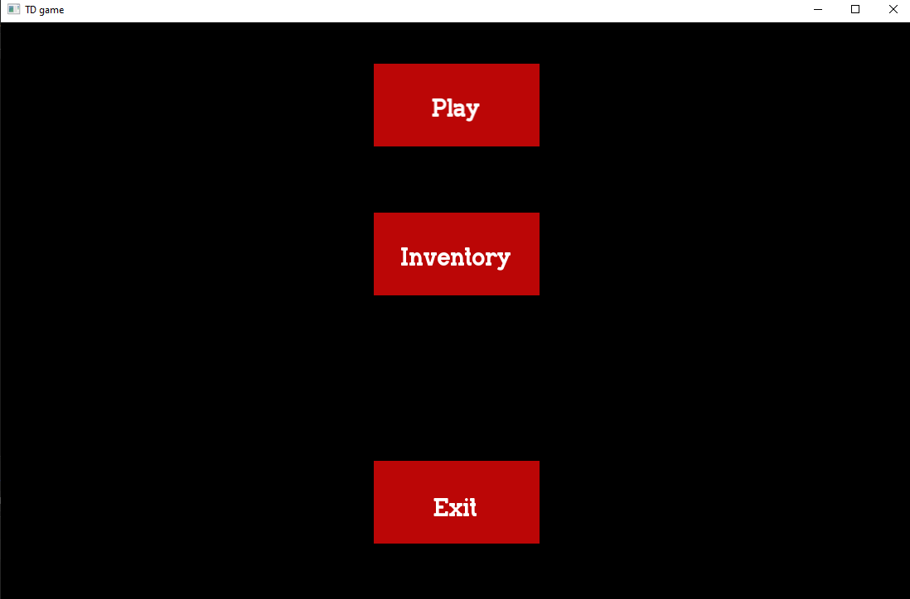
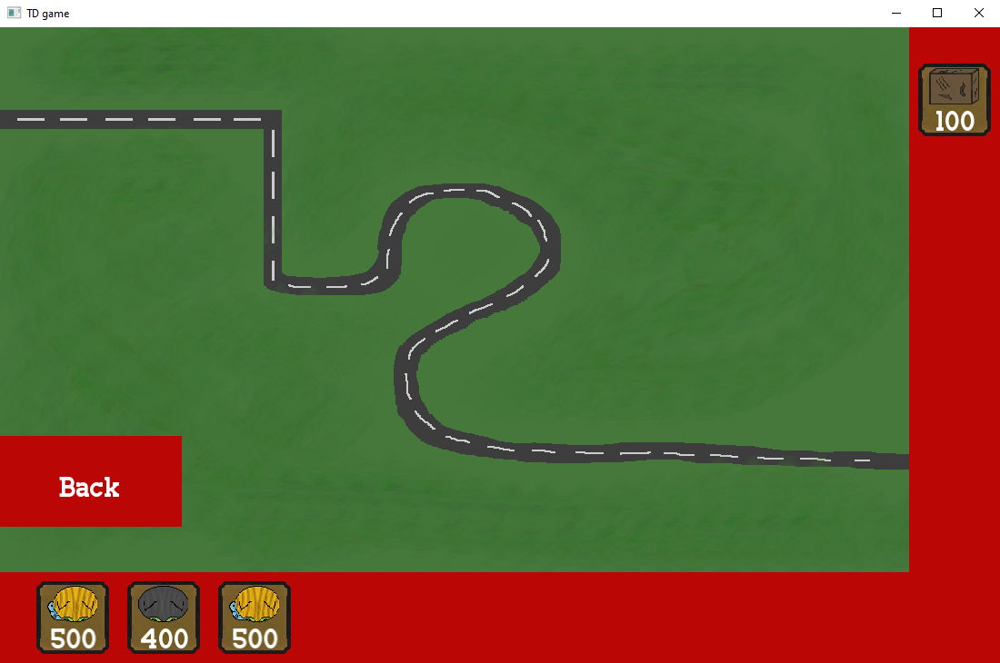
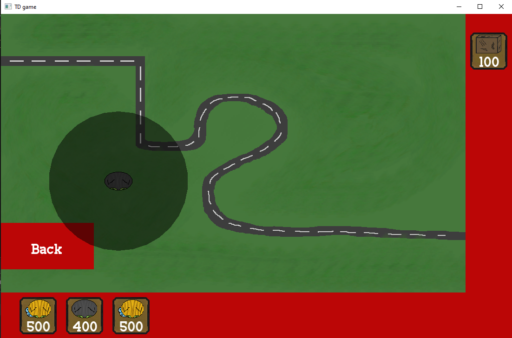
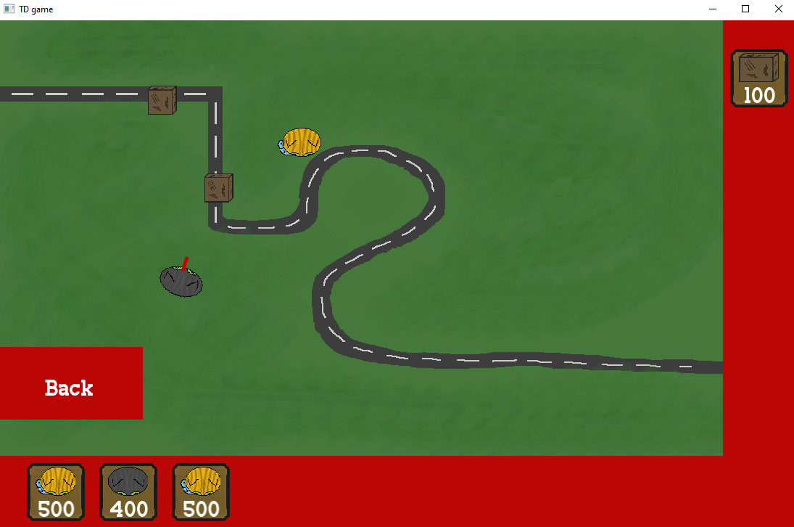

### Description:
- A simple Tower Defense game made in C++ using the SFML library.
- Currently in development, but the basic mechanics are implemented.
- I consider this as a hobby project, so I don't have a specific timeline for completion. However, I will continue to work on it and add new features as I have time.

### Screenshots:

  
  
  
  

